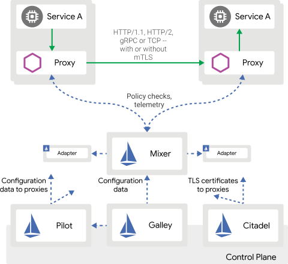
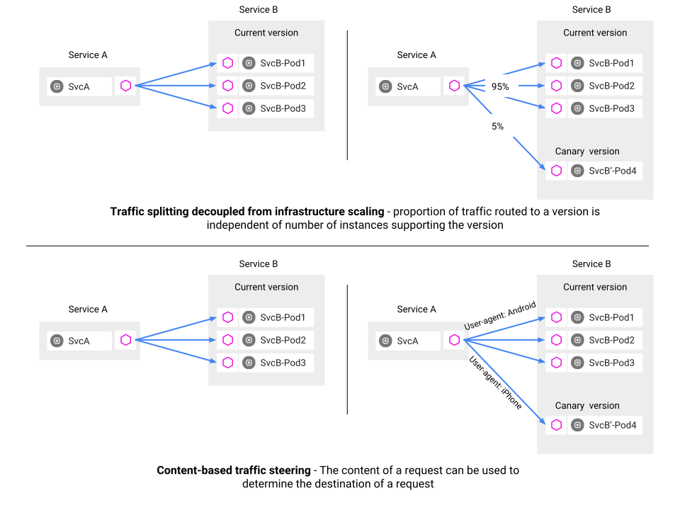

* [一、Istio是什么](#一、Istio是什么)
    * [什么是服务网格](#什么是服务网格)
    * [为什么要使用Istio](#为什么要使用Istio)
    * [特点](#特点)
    * [核心功能](#核心功能)
    * [架构](#架构)
    * [设计目标](#设计目标)

* [二、流量管理](#二、流量管理)
    * [Pilot和Envoy](#Pilot和Envoy)
    * [请求路由](#请求路由)
    * [服务发现和负载均衡](#服务发现和负载均衡)
    * [故障处理](#故障处理)
    * [故障注入](#故障注入)
    * [流量转移](#流量转移)
    * [规则配置](#规则配置)
    * [Virtual-Service](#Virtual-Service)
    * [目标规则](#目标规则)

* [三、安全](#三、安全)
    * [高级架构](#高级架构)
    * [Istio身份](#Istio身份)
    * [PKI](#PKI)
    * [认证](#认证)
    * [授权和鉴权](#授权和鉴权)

* [四、策略与遥感](#四、策略与遥感)
    * [适配器](#适配器)
    * [可靠性和延迟](#可靠性和延迟)
    * [属性](#属性)
    * [配置模型](#配置模型)
    * [处理器](#处理器)
    * [实例](#实例)
    * [规则](#规则)

* [五、性能与可伸缩性](#五、性能与可伸缩性)
    * [微基准测试](#微基准测试)
    * [测试场景](#测试场景)
    * [端到端综合基准测试](#端到端综合基准测试)
    * [现实应用程序基准测试](#现实应用程序基准测试)
    * [自动化测试](#自动化测试)
    * [可伸缩性和规模调整指南](#可伸缩性和规模调整指南)    

* [六、多集群部署](#六、多集群部署)
    * [多集群服务网格](#基本可用)

* [参考](#参考)

# 一、Istio是什么

## 什么是服务网格

> 服务网格（Service Mesh）这个术语通常用于描述构成这些应用程序的微服务网络以及应用之间的交互。随着规模和复杂性的增长，服务网格越来越难以理解和管理。它的需求包括`服务发现`、`负载均衡`、`故障恢复`、`指标收集`和`监控`以及通常更加复杂的运维需求，例如 A/B 测试、金丝雀发布、限流、访问控制和端到端认证等。

> 服务网格是用于处理服务间通信的专用基础设施层。它负责通过包含现代云原生应用程序的复杂服务拓扑来可靠地传递请求。实际上，服务网格通常通过一组轻量级网络代理来实现，这些代理与应用程序代码一起部署，而不需要感知应用程序本身。—— Willian Morgan Buoyant CEO

## 为什么要使用Istio

Istio 提供一种简单的方式来为已部署的服务建立网络，该网络具有负载均衡、服务间认证、监控等功能，只需要对服务的代码进行一点或不需要做任何改动。想要让服务支持 Istio，只需要在您的环境中部署一个特殊的 sidecar 代理，使用 Istio 控制平面功能配置和管理代理，拦截微服务之间的所有网络通信：

* HTTP、gRPC、WebSocket 和 TCP 流量的自动负载均衡。
* 通过丰富的路由规则、重试、故障转移和故障注入，可以对流量行为进行细粒度控制。
* 可插入的策略层和配置 API，支持访问控制、速率限制和配额。
* 对出入集群入口和出口中所有流量的自动度量指标、日志记录和追踪。
* 通过强大的基于身份的验证和授权，在集群中实现安全的服务间通信。

## 特点

* 应用程序间通讯的中间层
* 轻量级网络代理
* 应用程序无感知
* 解耦应用程序的重试/超时、监控、追踪和服务发现

## 核心功能

### 流量管理
通过简单的规则配置和流量路由，控制服务之间的流量和 API 调用。简化了断路器、超时和重试等服务级别属性的配置，并且可以轻松设置 A/B测试、金丝雀部署和基于百分比的流量分割的分阶段部署等重要任务。

### 安全
提供底层安全通信信道，并大规模管理服务通信的认证、授权和加密。

### 可观察性
Istio 强大的追踪、监控和日志记录可让您深入了解服务网格部署。

Istio 的 Mixer 组件负责策略控制和遥测收集。它提供后端抽象和中介，将 Istio 的其余部分与各个基础架构后端的实现细节隔离开来，并为运维提供对网格和基础架构后端之间所有交互的细粒度控制。

所有这些功能可以让您可以更有效地设置、监控和实施服务上的 SLO。

### 平台支持
Istio 目前支持：

* 在 Kubernetes 上部署的服务

* 使用 Consul 注册的服务

* 在虚拟机上部署的服务

### 集成和定制
策略执行组件可以扩展和定制，以便与现有的 ACL、日志、监控、配额、审计等方案集成。

## 架构

Istio 服务网格逻辑上分为数据平面和控制平面。

* 数据平面由一组以 sidecar 方式部署的智能代理（Envoy）组成。这些代理可以调节和控制微服务及 Mixer 之间所有的网络通信。

* 控制平面负责管理和配置代理来路由流量。此外控制平面配置 Mixer 以实施策略和收集遥测数据。

### Envoy
Istio 使用 Envoy 代理的扩展版本，Envoy 是以 C++ 开发的高性能代理，用于调解服务网格中所有服务的所有入站和出站流量。Envoy 的许多内置功能被 Istio 发扬光大，例如：

* 动态服务发现
* 负载均衡
* TLS 终止
* HTTP/2 & gRPC 代理
* 熔断器
* 健康检查、基于百分比流量拆分的灰度发布
* 故障注入
* 丰富的度量指标
Envoy 被部署为 sidecar，和对应服务在同一个 Kubernetes pod 中。这允许 Istio 将大量关于流量行为的信号作为属性提取出来，而这些属性又可以在 Mixer 中用于执行策略决策，并发送给监控系统，以提供整个网格行为的信息。

Sidecar 代理模型还可以将 Istio 的功能添加到现有部署中，而无需重新构建或重写代码。可以阅读更多来了解为什么我们在设计目标中选择这种方式。

### Mixer
Mixer 是一个独立于平台的组件，负责在服务网格上执行访问控制和使用策略，并从 Envoy 代理和其他服务收集遥测数据。代理提取请求级属性，发送到 Mixer 进行评估。有关属性提取和策略评估的更多信息，请参见 Mixer 配置。

Mixer 中包括一个灵活的插件模型，使其能够接入到各种主机环境和基础设施后端，从这些细节中抽象出 Envoy 代理和 Istio 管理的服务。

### Pilot
Pilot 为 Envoy sidecar 提供服务发现功能，为智能路由（例如 A/B 测试、金丝雀部署等）和弹性（超时、重试、熔断器等）提供流量管理功能。它将控制流量行为的高级路由规则转换为特定于 Envoy 的配置，并在运行时将它们传播到 sidecar。

Pilot 将平台特定的服务发现机制抽象化并将其合成为符合 Envoy 数据平面 API 的任何 sidecar 都可以使用的标准格式。这种松散耦合使得 Istio 能够在多种环境下运行（例如，Kubernetes、Consul、Nomad），同时保持用于流量管理的相同操作界面。

### Citadel
Citadel 通过内置身份和凭证管理赋能强大的服务间和最终用户身份验证。可用于升级服务网格中未加密的流量，并为运维人员提供基于服务标识而不是网络控制的强制执行策略的能力。从 0.5 版本开始，Istio 支持基于角色的访问控制，以控制谁可以访问您的服务，而不是基于不稳定的三层或四层网络标识。

### Galley
Galley 代表其他的 Istio 控制平面组件，用来验证用户编写的 Istio API 配置。随着时间的推移，Galley 将接管 Istio 获取配置、 处理和分配组件的顶级责任。它将负责将其他的 Istio 组件与从底层平台（例如 Kubernetes）获取用户配置的细节中隔离开来。

## 设计目标
Istio 的架构设计中有几个关键目标，这些目标对于使系统能够应对大规模流量和高性能地服务处理至关重要。

* **最大化透明度**：若想 Istio 被采纳，应该让运维和开发人员只需付出很少的代价就可以从中受益。为此，Istio 将自身自动注入到服务间所有的网络路径中。Istio 使用 sidecar 代理来捕获流量，并且在尽可能的地方自动编程网络层，以路由流量通过这些代理，而无需对已部署的应用程序代码进行任何改动。在 Kubernetes中，代理被注入到 pod 中，通过编写 iptables 规则来捕获流量。注入 sidecar 代理到 pod 中并且修改路由规则后，Istio 就能够调解所有流量。这个原则也适用于性能。当将 Istio 应用于部署时，运维人员可以发现，为提供这些功能而增加的资源开销是很小的。所有组件和 API 在设计时都必须考虑性能和规模。

* **可扩展性**：随着运维人员和开发人员越来越依赖 Istio 提供的功能，系统必然和他们的需求一起成长。虽然我们期望继续自己添加新功能，但是我们预计最大的需求是扩展策略系统，集成其他策略和控制来源，并将网格行为信号传播到其他系统进行分析。策略运行时支持标准扩展机制以便插入到其他服务中。此外，它允许扩展词汇表，以允许基于网格生成的新信号来执行策略。

* **可移植性**：使用 Istio 的生态系统将在很多维度上有差异。Istio 必须能够以最少的代价运行在任何云或预置环境中。将基于 Istio 的服务移植到新环境应该是轻而易举的，而使用 Istio 将一个服务同时部署到多个环境中也是可行的（例如，在多个云上进行冗余部署）。

* **策略一致性**：在服务间的 API 调用中，策略的应用使得可以对网格间行为进行全面的控制，但对于无需在 API 级别表达的资源来说，对资源应用策略也同样重要。例如，将配额应用到 ML 训练任务消耗的 CPU 数量上，比将配额应用到启动这个工作的调用上更为有用。因此，策略系统作为独特的服务来维护，具有自己的 API，而不是将其放到代理/sidecar 中，这容许服务根据需要直接与其集成。

# 二、流量管理

使用 Istio 的流量管理模型，本质上是**将流量与基础设施扩容解耦**，让运维人员可以通过 Pilot 指定流量遵循什么规则，而不是指定哪些 pod/VM 应该接收流量——Pilot 和智能 Envoy 代理会帮我们搞定。因此，例如，您可以通过 Pilot 指定特定服务的 5％ 流量可以转到金丝雀版本，而不必考虑金丝雀部署的大小，或根据请求的内容将流量发送到特定版本。

将流量从基础设施扩展中解耦，这样就可以**让 Istio 提供各种独立于应用程序代码之外的流量管理功能**。 除了 A/B 测试的动态请求路由，逐步推出和金丝雀发布之外， 它还使用超时、重试和熔断器来处理故障恢复， 最后还可以通过故障注入来测试服务之间故障恢复策略的兼容性。 这些功能都是通过在服务网格中部署的 Envoy sidecar/代理来实现的。

## Pilot和Envoy

Istio 流量管理的核心组件是 `Pilot`，它**管理和配置部署在特定 Istio 服务网格中的所有 `Envoy` 代理实例**。它允许您**指定在 Envoy 代理之间使用什么样的路由流量规则，并配置故障恢复功能，如超时、重试和熔断器**。它还**维护了网格中所有服务的规范模型**，并使用这个模型通过发现服务让 Envoy 了解网格中的其他实例。

每个 `Envoy` 实例都会**维护负载均衡信息信息**，这些信息来自 `Pilot` 以及对负载均衡池中其他实例的定期健康检查。从而允许其在目标实例之间智能分配流量，同时遵循其指定的路由规则。

`Pilot` 负责管理通过 Istio 服务网格发布的 `Envoy` 实例的生命周期。

如上图所示，在网格中 `Pilot` 维护了一个服务的规则表示并独立于底层平台。`Pilot`中的特定于平台的适配器负责适当地填充这个规范模型。例如，在 `Pilot` 中的 `Kubernetes` 适配器实现了必要的控制器，来观察 Kubernetes API 服务器，用于更改 pod 的注册信息、入口资源以及存储流量管理规则的第三方资源。这些数据被转换为规范表示。然后根据规范表示生成特定的 `Envoy` 的配置。

`Pilot` 公开了用于服务发现 、负载均衡池和路由表的动态更新的 API。

运维人员可以通过 `Pilot` 的 Rules API 指定高级流量管理规则。这些规则被翻译成低级配置，并通过 discovery API 分发到 `Envoy` 实例。

## 请求路由

## 服务发现和负载均衡

## 故障处理

## 故障注入

## 规则配置

## Virtual Service

## 目标规则

# 三、安全

## 高级架构

## Istio身份

## PKI

## 最佳实践

## 认证

## 授权和鉴权

# 四、策略与遥感

## 适配器

## 可靠性和延迟

## 属性

## 配置模型

## 处理器

## 实例

## 规则

# 参考
- [istio.io](https://preliminary.istio.io/zh/)